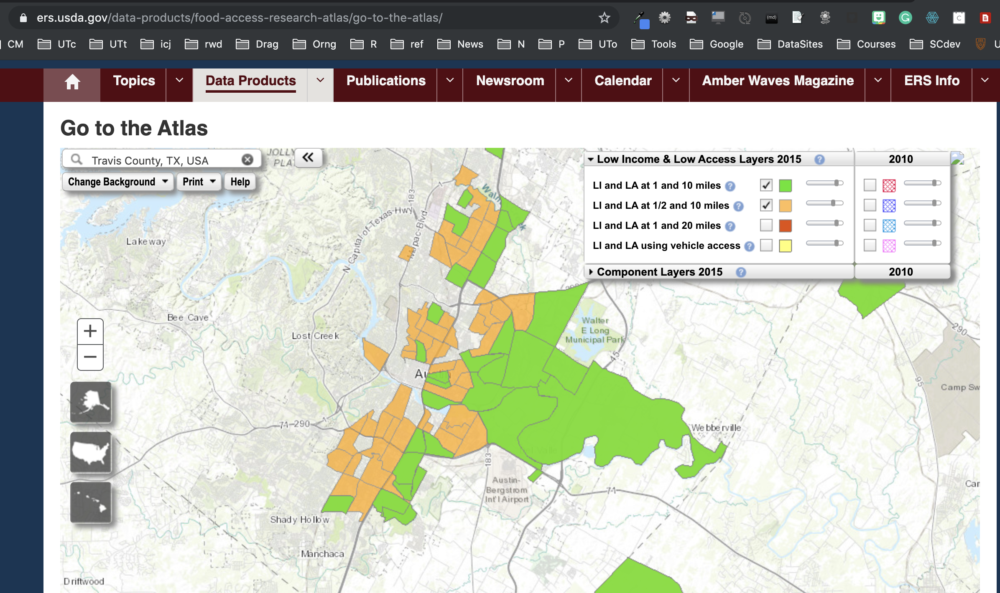

# Food desert data

This is a project to prepare Food Access data to join with spatial files to put in Tableau. We're basically trying to make a version of this map, you can [build here](https://www.ers.usda.gov/data-products/food-access-research-atlas/go-to-the-atlas/).

Unfortunatly, in the end Tableau isn't as cool as the atlas above (which I think is ArcGIS online.)

## Getting the data

Data file _Food Access Research Atlas Data Download 2015_ downloaded from [United States Department of Agriculture](https://www.ers.usda.gov/data-products/food-access-research-atlas/download-the-data/). It is downloaded as `data-raw/DataDownload2015.xlsx`. This has three tabs. I saved the tab **Variables Lookup** as it's own file `data-dictionary.xlsx` for reference in a smaller file.

## 01-import

[01-import](https://utdata.github.io/rwd-food-desert/01-import.html) imports the file from Excel, selects the columns we need and filters it to Travis County, Texas. There are 2018 rows.

## 02-data-wrangle

[02-data-wrangle](https://utdata.github.io/rwd-food-desert/02-data-wrangle.html) does some data checking and creates columns that can more easily show the food access level of each census tract.

Exports from this notebook will be used to join datain QGIS.

## 03-mapping

This is a dream to finish this in R.

## csvkit

The folder [csvkit](csvkit) has some earlier work to convert the Excel file to csv. It's moot at this point, but I'm keeping it as a learning experience.

